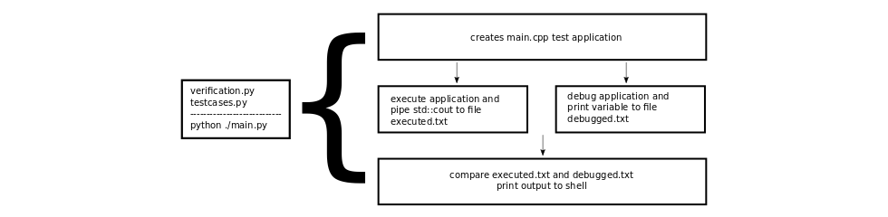

## Verification:

The verificiation is based on a comparison between the standard output implementation of SystemC and the written Pretty-Printer and can be found in the directory "verification".

## 

"Verification.py" includes methodes to create a "main.cpp" and stores the variable names. Further on it creates a debugable "main" and executes this as normal program and as a debuged version. Executed as normal program it prints all variables and stores the output within the file "executed.txt". Furthermore the debugable is executed within gdb, each value is printed via the "gdb print" command and the outcome is stored within the file "debugged.txt". The two files "debugged.txt" and "executed.txt" are compared at the end. If both files are similiar the outcome should be correct, as long as SystemC is correct.

This method is not the best. First of all, I don't compare my expectation of output value with the gdb output, because this would require a lot of time to check, correct and write all values. Therefore I have to be confindent that the SystemC standard output implementation is correct. Furthermore it takes some time to debug all values. However, it was the simplest, which came to my mind.

Further testcases can be appended within "Testcases.py".

